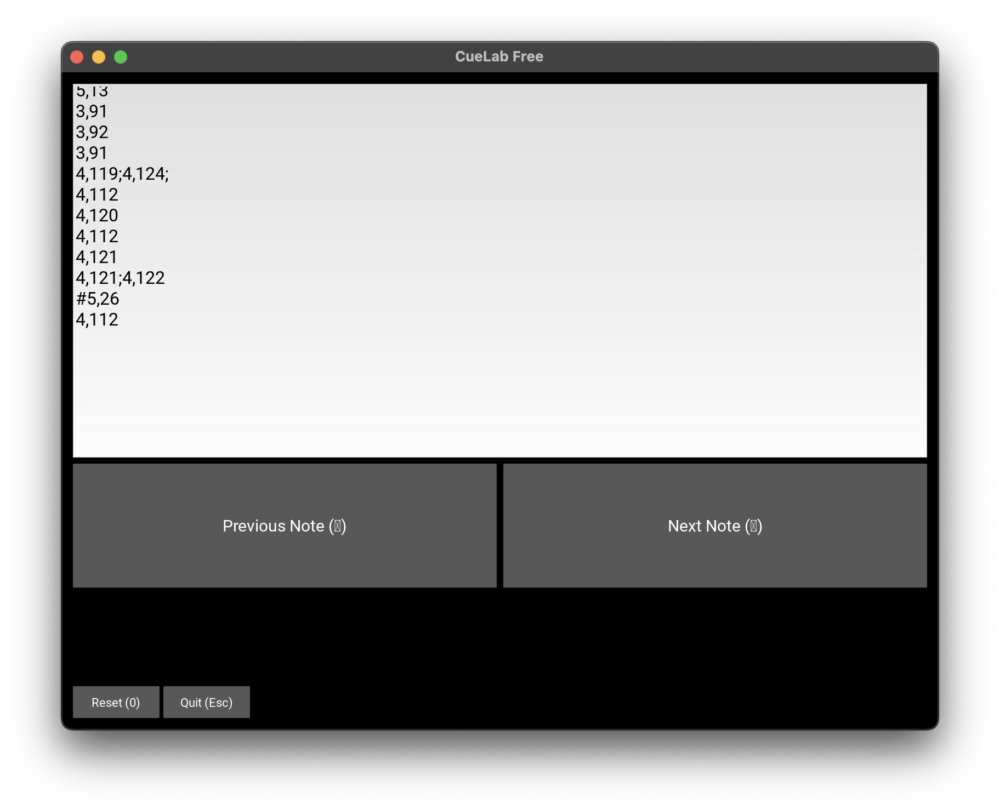

# Purpose
With 'CueLab FREE' you can run a pre-programmed list of MIDI notes (e.g. for lightshows or lasershows).

# Installation
Install requirements: `pip install -r requirements.txt`

# Run program
Run program: `python main.py`